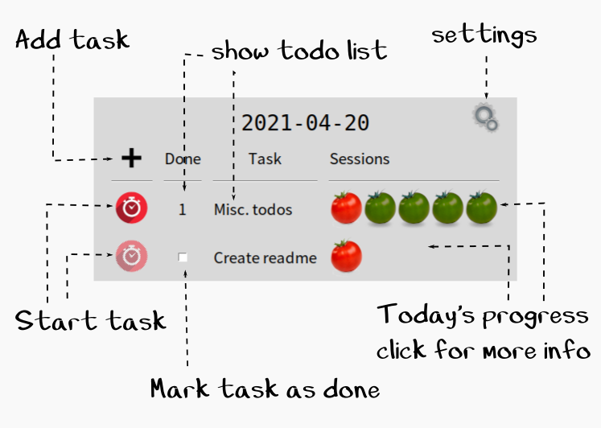

# Yet Another Pomodoro Timer

## Fetures:

* Manager tasks.
* Start a sesion timer for a given task.
* (Optionally) Add a short note after a session.
* Show session history for a task.
* A "Todo task" that captures trivial things which does worth a whole session.

## Quick Start

1. Download the files, extract the contents.
2. Run the `main.py` file using python 3.

The program requires the `tkinter` package, which may need a separate installation on some systems.

## Usage

The following diagram shows the main features of the app.

The rest of interactions with the application are self explaining.

## Some Notes:

1. A task is not "a task for today", it will stay in the list until it's marked as done. 

2. A task is assigned a certain number of sessions for each day. After all the assigned sessions are used, one can not start the session. The sessions will be restored when the task list is reloaded (see below).

3. Tasks marked as done will stay in the list for the rest of day, to show some progress of the day.

4. The task list will be reloaded when the app is restarted or when the date  changed.

5. There are two type of sessions for different kind of tasks: long (50 minutes of work plus 10 minutes of rest) and short (25m plus 5m). The time lengths can be changed in settings.